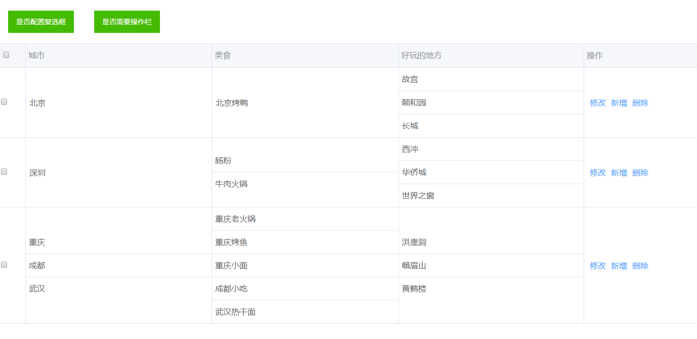

> vue clock component


## Install

```
npm install vue-split-table 
```

## Attributes

| 参数 | 说明 | 类型 | 是否必传 | Default |
|-|-|-|-|-|
| headData | 表头内容 | Array | 必传 | - |
| bodyData | 表体内容 | Array | 必传 | - |
| checkFlag | 是否有复选列 | Boolean | 可选 | True |
| tableEditFlag | 表格是否可编辑 | Boolean | 可选 | True |
| operFlag | 是否有操作列 | Boolean | 可选 | True |

## Events

| name | 说明 | 参数 | 
|-|-|-|
| multipleData | 当选项发生变化触发 | multipleData |
| editData | 表格编辑文本框失焦触发 | editData |

## Slot

| 事件名 | 说明 |
|-|-|-|
| operate | 配置操作列后就可通过设置slot来配置操作的内容 |

## Example

```
<template>
  <split-table :headData="headData" :bodyData="bodyData" @multipleData="multipleData" @editData="editData">
    <template slot="operate" slot-scope="props">
      <span @click="splitEdit(props.rowData)">修改</span>
      <span @click="splitAdd(props.rowData)">新增</span>
      <span @click="splitDel(props.rowData)">删除</span>
    </template>
  </split-table>
</template>

<script>
  import SplitTable from 'vue-split-table';
  export default {
    components: { SplitTable },
    data () {
      return {
         headData: ["城市", "美食", "好玩的地方"],
      bodyData: [
        { city: "北京", food: "北京烤鸭", fun: ["故宫", "颐和园", "长城"] },
        {
          city: "深圳",food: ["肠粉", "牛肉火锅"],fun: ["西冲", "华侨城", "世界之窗"]
        },
        {
          city: ["重庆", "成都", "武汉"],
          food: ["重庆老火锅","重庆烤鱼","重庆小面","成都小吃","武汉热干面"],
          fun: ["洪崖洞", "峨眉山", "黄鹤楼"]
        }
      ], 
      }
    },
    methods: {
    splitEdit(rowData) {
      console.log("rowData值为", rowData);
    },

    editData(data) {
      console.log("编辑所在行的值为", data);
    }

    splitAdd(data) {
      console.log("新增所在行的值为", data);
    },

    splitDel(data) {
      console.log("删除所在行的值为", data);
    },

    multipleData(data) {
      console.log("复选框选择的值为", data);
    }
    }
  }
</script>
```